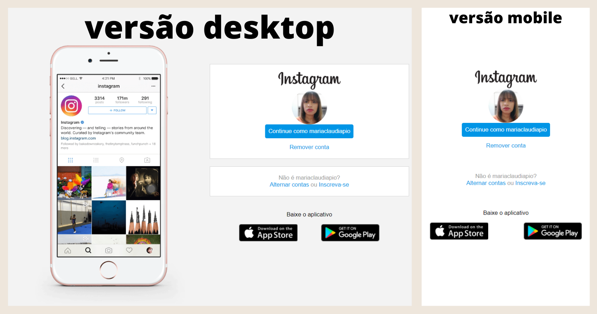

<h1 align="center">Olá visitante! 🙋🏽‍♀️</h1>

Bem vindo ao meu novo projeto! Ele foi inspirado no desafio de código do *bootcamp* "Spread Fullstack Developer" da Digital Innovation One, proposto pela *expert* Gabriela Pinheiro. Trata-se da reconstrução da página de login do Instagram, fazendo uso de CSS com Flexbox, uma das abordagens de posicionamento de elementos mais utilizadas quando se trata de responsividade. 

 

<h2 align="center">🛠️ Como visualizar o projeto</h2> 

Baixe os todos os arquivos no seu computador. Clique duas vezes no arquivo 'index.html'. Logo, o projeto rodará no seu navegador. 

**Dica:** *Você pode ir reduzindo o tamanho da janela na tela para ir percebendo a reorganização dos items.*

 
